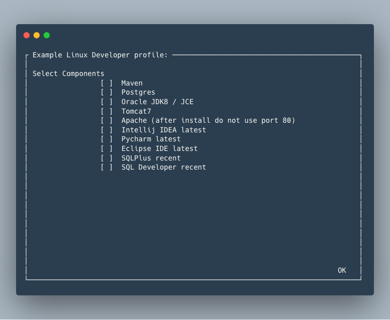

NOW HOSTED AT https://github.com/saltstack-formulas/salt-desktop !!!!!!!

# Salt Desktop

Salt Desktop orchestrates useful software onto Linux/MacOS without fuss.

## Quick start

Install salt on MacOS or GNU/Linux (Ubuntu/Debian/CentOS/SuSE):

          curl -o salt.sh https://raw.githubusercontent.com/saltstack-formulas/salt-desktop/master/bin/salt.sh && sudo bash salt.sh

Customize your site (i.e. dns/ntp/domain/krb/etc):

          sudo vi /srv/salt/profiles/config.sls

## Profiles: Menu example

Provision a Desktop via Menu:

          sudo /usr/local/bin/devsetup -u username


<a href="https://github.com/saltstack-formulas/salt-desktop/blob/master/bin/menu.py"></a>


## Profiles: Stack example

Provision Linux Developer desktop (with oracle jdk and tomcat):

          sudo /usr/local/bin/devsetup -u username -s dev

OR .. provision Linux Developer desktop (without oracle jdk/tomcat):

          sudo /usr/local/bin/devsetup -u username -s corpsys/dev

OR .. provision MacBook Developer desktop:

          sudo /usr/local/bin/devsetup -u username -s macbook

OR .. join Linux host to Active Directory:

          sudo /usr/local/bin/devsetup -u domainadm -s corpsys/joindomain-clean

          sudo /usr/local/bin/devsetup -u domainadm -s corpsys/joindomain

          sudo net ads join EXAMPLE.COM -U nmcloughlin

          sudo kinit -k UPPERCASE_HOSTNAME\\$@EXAMPLE.COM   # On failure retry after few minutes

          sudo systemctl restart winbind

AND .. provision Citrix LinuxVDA:

          sudo /usr/local/bin/devsetup -u domainadm -s corpsys/linuxvda


OR ... build your own profile ...:

          sudo -s
          cd /srv/salt/profiles/stacks
          cp template my_own_stack
          vi my_own_stack
          /usr/local/bin/devsetup -u username -s my_own_stack
          

## Profiles: App example

Remove postgres:

          sudo /usr/local/bin/devsetup -u username -a postgres/remove

OR ... cleaninstall postgres:

          sudo /usr/local/bin/devsetup -u username -a postgres/cleaninstall


OR ... build your own profile ...:

          sudo -s
          cd /srv/salt/profiles/apps
          cp template my_own_app
          vi my_own_app
          /usr/local/bin/devsetup -u username -s my_own_app


<br></br>
## Ecosystem

At least the following software, hosted at https://github.com/saltstack-formulas, are verfied with Salt-Desktop. All software downloads are checksum verified and can be stored on your internal network.

| Upstream formula  	| Linux | MacOS	| Notes         | 	
|---------------	|------	|-------|-------------	|
| apache        	|  yes  |   -  	|   	   	|
| ceph.repo        	|  yes  |   -  	|   	   	|
| chrony        	|  yes  |   -  	|   	   	|
| linuxVda        	|  yes  |   -  	|   	   	|
| deepsea        	|  yes  |   -  	|   	   	|
| devstack        	|  yes  |   -  	| + OSC CLI     |
| docker        	|  yes  |   	|   	   	|
| eclipse        	|  yes  |  yes 	|   	   	|
| etcd              	|  yes  |  yes 	|   	   	|
| etcd.docker        	|  yes  |  yes 	|   	   	|
| firewalld         	|  yes  |   -  	|   	   	|
| golang        	|  yes  |   	|   	   	|
| hadoop        	|  yes  |   -  	|   	   	|
| iscsi             	|  yes  |   -  	|   	   	|
| jetbrains-intelliJ 	|  yes  |  yes 	|   	   	|
| jetbrains-datagrip 	|  yes  |  yes 	|   	   	|
| jetbrains-phpstorm 	|  yes  |  yes 	|   	  	|
| jetbrains-webstorm 	|  yes  |  yes 	|   	   	|
| jetbrains-pycharm 	|  yes  |  yes 	|   	   	|
| jetbrains-goland 	|  yes  |  yes 	|   	   	|
| kerberos        	|  yes  |   -  	|   	   	|
| lxd              	|  yes  |   -  	|   	   	|
| lvm              	|  yes  |   - 	|   	   	|
| maven              	|  yes  |  yes	|   	   	|
| mysql              	|  yes  |  yes 	|+maria,wrkbench|
| mongodb        	|  yes  |  yes	| +BI connector	|
| opensds        	|  yes  |   -  	|   	   	|
| sun-java       	|  yes  |  yes 	| +JRE/JDK/JCE	|
| packages      	|  yes  |  yes 	|   	   	|
| postgres      	|  yes  |  yes 	|   	   	|
| resolver         	|  yes  |   - 	|   	   	|
| salt            	|  yes  |  yes 	|   	   	|
| samba             	|  yes  |   -  	|   	   	|
| sqlplus       	|  yes  |  yes 	|   	  	|
| sqldeveloper       	|  yes  |  yes 	|   	   	|
| timezone       	|  yes  |   -  	|   	   	|
| tomcat            	|  yes  |  yes 	|   	  	|
| users                 |  yes  |   -  	|   	  	|
|                       |  	|   	|   	   	|

<br/><br/>
## EXAMPLES ..

### Join Active Directory Domain and setup Citrix Linux VDA
```bash
$ sudo devsetup -u domainadm -s corpsys/cleanup; sudo devsetup -u domainadm -s corpsys/joindomain

custom choice [ stacks/corpsys/joindomain ] selected
Logging to [ /tmp/saltdesktop/stacks/corpsys/joindomain/log.201804110644 ]
Orchestrating things, please be patient ...
Summary for local
--------------
Succeeded: 127 (changed=98)
Failed:      0
Warnings:    1
--------------


domainadm@myhost4:~$ sudo net ads join EXAMPLE.COM -U nmcloughlin
Enter nmcloughlin password:
Using short domain name -- EXAMPLE
Joined MYHOST4 to dns domain example.com
DNS Update for myhost4.example.com failed: ERROR_DNS_GSS_ERROR
DNS update failed: NT_STATUS_UNSUCCESSFUL

domainadm@myhost4:~$ sudo kinit -k MYHOST4\$@EXAMPLE.COM
domainadm@myhost4:~$ sudo systemctl restart winbind


domainadm@myhost4:~$ sudo /usr/local/bin/devsetup -u domainadm -s corpsys/linuxvda
custom choice [ stacks/corpsys/linuxvda ] selected
Logging to [ /tmp/saltdesktop/stacks/corpsys/linuxvda/log.201804110804 ]
Orchestrating things, please be patient ...
Summary for local
--------------
Succeeded: 18 (changed=10)
Failed:     0
--------------

```

### Sudo Access
```bash
$ sudo devsetup -u jdoe -a sudo

custom choice [ apps/sudo ] selected
Logging to [ /tmp/saltdesktop/apps/sudo/log.201804110702 ]
Orchestrating things, please be patient ...

Summary for local
-------------
Succeeded: 11 (changed=5)
Failed:     2
-------------
Total states run:     13
Total run time:   25.748 s
See full log in [ /tmp/saltdesktop/apps/sudo/log.201804110702 ]
```


